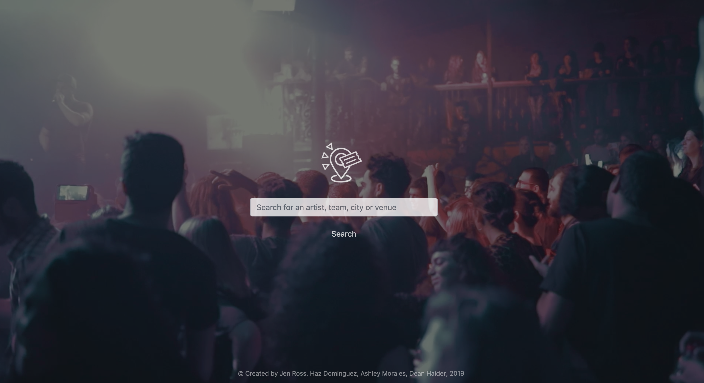
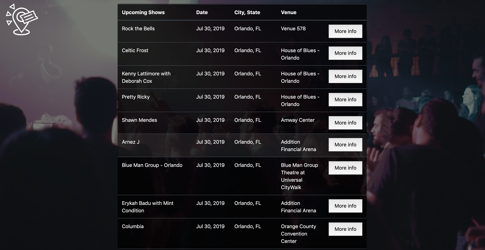
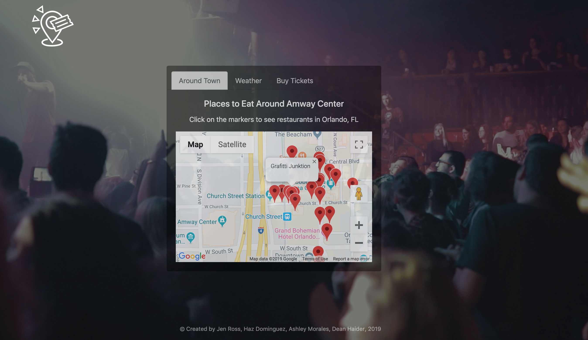
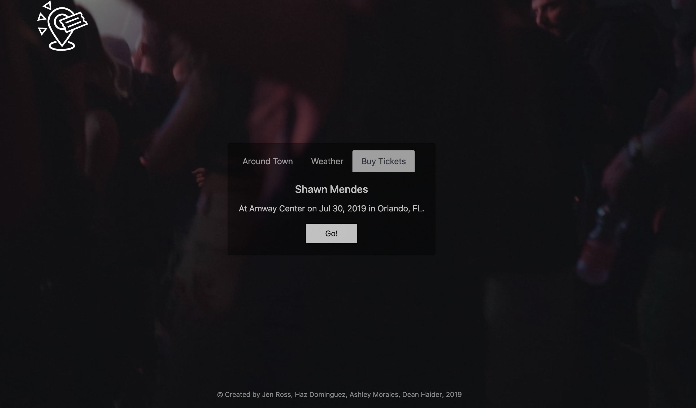

<h1>S.I.T. (Shows in Town)</h1>

The founders of the S.I.T. application designed it to be a one-stop shop to make your next experience at a festival, concert, sporting event, or club show an effortless one.

Type in an artist, team, city, or venue and you will see the top 10 upcoming events that match your search.

Click the "More Info" button to see a map of the area around the venue with markers to help you find popular restaurants (rated by Foursquare users).

One tab over, the S.I.T. application provides the weather forecast (AccuWeather) for the week of the event.
 

Now that you've found the right event and planned your day, go to the "Buy Tickets" tab and click on the "Go!" button to purchase tickets through SeatGeek.
 

Check out the site <a href="https://jenross.github.io/event-search/" target="_blank">here</a>.

**Prerequisites:**
* Project Goal:
  * Build Something Awesome
* Requirements:
   * Must uses at least two APIs
   * Must use AJAX to pull data
   * Must utilize at least one new library or technology that we haven’t discussed
   * Must have a polished frontend / UI
   * Must meet good quality coding standards (indentation, scoping, naming)
   * Must NOT use alerts, confirms, or prompts (look into modals!)
   * Must have some sort of repeating element (table, columns, etc)
   * Must use Bootstrap or Alternative CSS Framework
   * Must be Deployed (GitHub Pages or Firebase)
   * Must have User Input Validation

**Coded with:**
   *HTML
   *CSS
   *Javascript
   *jQuery 

**APIs Integrated:**
   *SeatGeek 
   *FourSquare
   *Google Maps
   *AccuWeather

**Additional Libraries/Frameworks:**
   *Bootstrap
   *Moment.js
   *Bideo.js
